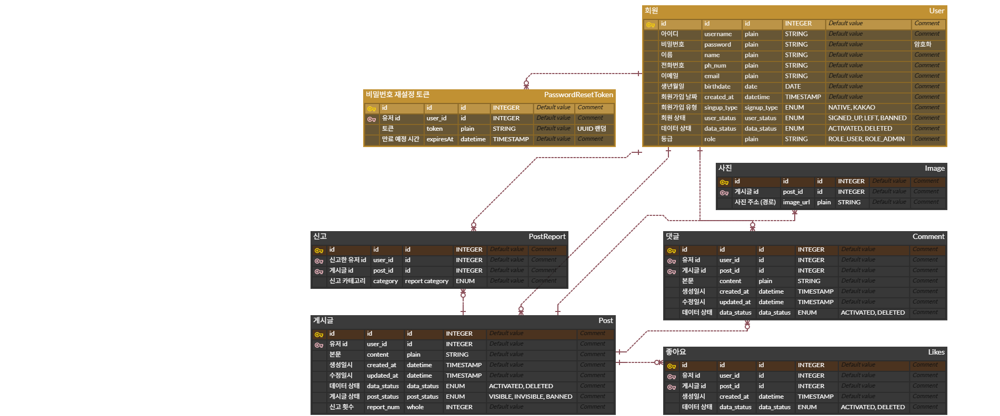

본 프로젝트는 2025년 9월 진행된 그릿지테스트 응시용입니다.  
ERD에 색으로 표기된 바와 같이 user와 post, 두 개의 root로 작업했습니다.

### /config
여러가지 설정 파일들입니다.
+ Email
+ Firebase
+ PasswordEncoder
+ QueryDsl
+ Security
+ Swagger

### /controller
Controller Layer입니다.  

### /exception
커스텀 예외 처리 클래스들입니다.

### /repository
DataManager Layer입니다.
JPA 사용을 위한 @Entity 클래스들도 위치해 있습니다.

### /security
인증 인가 관련 클래스들입니다.

### /service
Service Layer입니다.